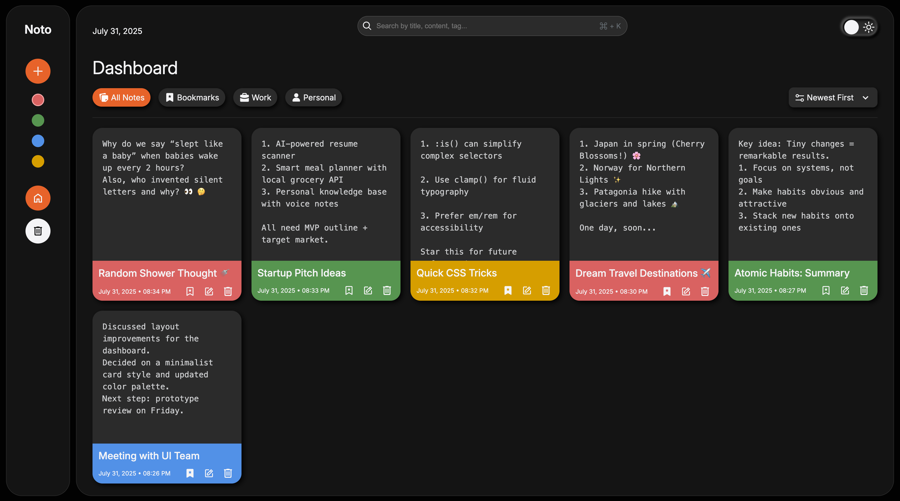

# Noto - A simple Notes App made with HTML, CSS and JS  

  

# Live Preview  
[Noto - Notes App](https://prateek1789.github.io/Notes-App/) 

# App Features

Noto is a part of my practice projects to sharpen my knowledge. Noto features:-
- Basic CRUD opertaions   
- Soft delete and Hard delete   
- Bookmark/Star notes   
- View notes based on four main tags: All Notes, Bookmarks, Work, Personal  
- Sort Notes based on two options: Newest first or Oldest First    
- Tab aware Search for notes by Title, Content, Tags    
- Dashboard tab/folder for all active notes and Trash tab/folder for notes that are trashed(Soft delete)    

Noto, being a Frontend project, currently uses Browsers local storage to store notes and does not have an actual backend.
